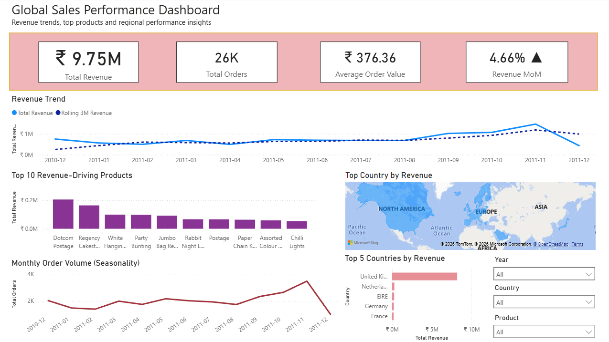
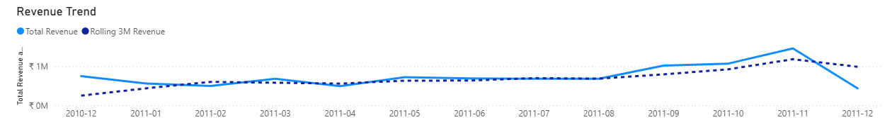
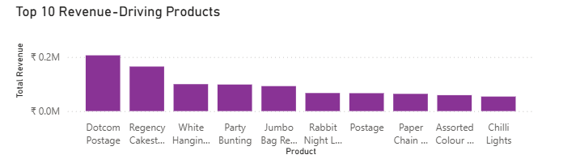
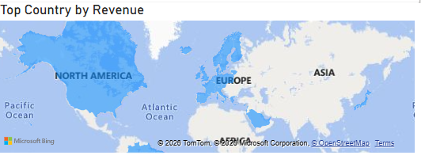
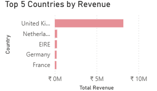
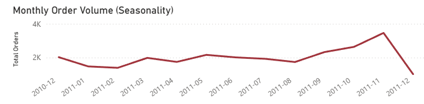

# Global E-Commerce Sales Performance Dashboard (Power BI)

## Overview

This project analyzes sales performance for a global online retailer using **Power BI**.  
The dashboard provides insights into **revenue growth, product performance, geographic sales distribution, and demand seasonality** to support data-driven decision-making by business leadership.

---

## Business Problem

A global online retailer operates across multiple countries and sells thousands of products.  
Leadership lacks clear visibility into:

- Revenue trends over time  
- High-performing products and regions  
- Seasonal demand patterns  

Without these insights, it becomes difficult to:

- Plan inventory and logistics  
- Focus marketing spend  
- Identify growth opportunities  

---

## Dashboard Objectives

The dashboard is designed to help stakeholders:

- Track revenue growth and momentum  
- Identify top revenue-driving products and countries  
- Understand demand seasonality  

---

## Key KPIs

| KPI | Description |
|----|------------|
| **Total Revenue** | Overall sales value generated |
| **Total Orders** | Number of unique orders |
| **Average Order Value (AOV)** | Revenue per order |
| **Revenue MoM %** | Month-over-month revenue growth |
| **Rolling 3-Month Revenue** | Smoothed revenue trend to reduce volatility |

---

## Key Visuals

### Dashboard Overview

---

### Revenue Trend (with Rolling 3-Month Average)
- Tracks revenue growth over time  
- Rolling average highlights underlying trend and reduces noise  

---

### Top 10 Revenue-Driving Products
- Identifies products contributing the most to revenue  
- Supports product strategy and merchandising decisions  

---

### Geographic Revenue Distribution
- Highlights top-performing countries  
- Helps evaluate regional market performance  

---

### Monthly Order Volume (Seasonality)
- Shows seasonal demand patterns  
- Supports inventory and marketing planning  

---

## Key Insights

- Revenue shows a **steady upward trend**, with stronger performance in later months.
- A **small set of products** drives a disproportionately large share of revenue.
- The **UK dominates total revenue**, indicating strong regional concentration.
- Demand peaks during **Q4**, indicating clear seasonality effects.
- Rolling 3-month revenue confirms **sustained growth** rather than short-term spikes.

---

## Business Recommendations

- Focus inventory and marketing investments on **top-performing products**.
- Continue investing in the UK to capitalize on its strong performance, while selectively expanding into high-potential non-UK regions to reduce long-term geographic dependency.
- Prepare inventory and logistics in advance of **seasonal demand peaks**.
- Use rolling trends rather than single-month changes for strategic planning.

---

## Tools & Technologies

- **Power BI**
- **DAX** (Time Intelligence, Rolling Averages, Growth Metrics)
- **Public E-Commerce Dataset (Kaggle)**

---

## Dataset

- **Source:** Public E-Commerce dataset (Invoice-level transactional data)  
- **Time Period:** Dec 2010 – Dec 2011  
- **Link:** https://www.kaggle.com/datasets/carrie1/ecommerce-data  

---

## Notes

- Year-over-year comparisons were avoided due to the limited time range.
- Month-over-month and rolling metrics were used for accurate trend analysis.

---

## Future Enhancements

- Customer segmentation (RFM analysis)
- Profit and margin analysis
- Forecasting using longer historical data
- Campaign effectiveness analysis
